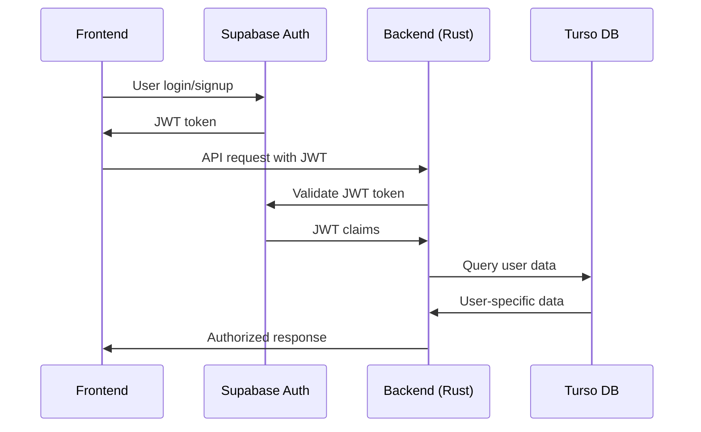

# Migrating from Clerk to Supabase Auth

This comprehensive guide details how to replace Clerk authentication with Supabase Auth in your Rust backend and implement frontend authentication.

## Table of Contents

- [Overview](#overview)
- [Authentication Flow](#authentication-flow)
- [Backend Implementation](#backend-implementation)
- [Frontend Implementation](#frontend-implementation)
- [Migration Steps](#migration-steps)
- [Security Considerations](#security-considerations)
- [Testing](#testing)
- [Troubleshooting](#troubleshooting)

## Overview

Supabase Auth provides JWT-based authentication where:
1. **Frontend**: Users authenticate via Supabase client
2. **JWT Token**: Supabase issues JWT tokens for authenticated users
3. **Backend**: Your Rust server validates JWT tokens
4. **Authorization**: User-specific data access based on JWT claims

### Key Benefits
- **Cost-effective**: More generous free tier than Clerk
- **Flexibility**: Pure auth service, no database lock-in
- **Integration**: Built-in email templates, social providers
- **Control**: You maintain full control over data in Turso

## Authentication Flow



## Backend Implementation

### 1. Update Dependencies

```toml
# Cargo.toml - Add/update these dependencies
[dependencies]
# Remove jsonwebtoken if using Supabase validation
# jsonwebtoken = "9.3.0"

# Add Supabase JWT validation
reqwest = { version = "0.12", features = ["json"] }
serde = { version = "1.0", features = ["derive"] }
serde_json = "1.0"
base64 = "0.22.1"
```

### 2. Supabase JWT Claims Structure

```rust
// src/auth.rs
use serde::{Deserialize, Serialize};

#[derive(Debug, Clone, Serialize, Deserialize)]
pub struct SupabaseClaims {
    pub aud: String,           // "authenticated"
    pub exp: i64,              // Expiration timestamp
    pub iat: i64,              // Issued at timestamp
    pub iss: String,           // Issuer (Supabase URL)
    pub sub: String,           // User UUID
    pub email: Option<String>, // User email
    pub phone: Option<String>, // User phone
    pub role: String,          // "authenticated"
    pub aal: String,           // Authentication assurance level
    pub amr: Vec<AmrEntry>,    // Authentication method reference
    pub session_id: String,    // Session identifier
    pub is_anonymous: Option<bool>,
    
    // User metadata
    pub user_metadata: Option<serde_json::Value>,
    pub app_metadata: Option<serde_json::Value>,
}

#[derive(Debug, Clone, Serialize, Deserialize)]
pub struct AmrEntry {
    pub method: String,
    pub timestamp: i64,
}
```

### 3. JWT Validation Implementation

```rust
// src/auth.rs
use reqwest;
use base64::{Engine as _, engine::general_purpose};
use serde_json::Value;

pub struct SupabaseConfig {
    pub project_url: String,
    pub anon_key: String,
    pub jwks_url: String,
}

impl SupabaseConfig {
    pub fn new() -> Self {
        let project_url = std::env::var("SUPABASE_URL")
            .expect("SUPABASE_URL must be set");
        let anon_key = std::env::var("SUPABASE_ANON_KEY")
            .expect("SUPABASE_ANON_KEY must be set");
        
        let jwks_url = format!("{}/auth/v1/jwks", project_url);
        
        Self {
            project_url,
            anon_key,
            jwks_url,
        }
    }
}

pub async fn validate_supabase_jwt(
    token: &str, 
    config: &SupabaseConfig
) -> Result<SupabaseClaims, AuthError> {
    // Decode JWT header to get key ID
    let header = decode_jwt_header(token)?;
    let kid = header.get("kid")
        .and_then(|v| v.as_str())
        .ok_or(AuthError::InvalidToken)?;

    // Fetch public keys from Supabase
    let jwks = fetch_jwks(&config.jwks_url).await?;
    let public_key = find_key_by_id(&jwks, kid)?;

    // Validate and decode JWT
    let claims = decode_and_validate_jwt(token, &public_key, &config.project_url)?;
    
    Ok(claims)
}

async fn fetch_jwks(jwks_url: &str) -> Result<Value, AuthError> {
    let response = reqwest::get(jwks_url)
        .await
        .map_err(|_| AuthError::JWKSFetchError)?;
    
    if !response.status().is_success() {
        return Err(AuthError::JWKSFetchError);
    }
    
    let jwks: Value = response.json()
        .await
        .map_err(|_| AuthError::JWKSParseError)?;
        
    Ok(jwks)
}

fn decode_jwt_header(token: &str) -> Result<Value, AuthError> {
    let parts: Vec<&str> = token.split('.').collect();
    if parts.len() != 3 {
        return Err(AuthError::InvalidToken);
    }

    let header_b64 = parts[0];
    let header_bytes = general_purpose::URL_SAFE_NO_PAD
        .decode(header_b64)
        .map_err(|_| AuthError::InvalidToken)?;
    
    let header: Value = serde_json::from_slice(&header_bytes)
        .map_err(|_| AuthError::InvalidToken)?;
        
    Ok(header)
}
```

### 4. Update Main Application

```rust
// src/main.rs
mod auth;

use auth::{SupabaseConfig, SupabaseClaims, validate_supabase_jwt, AuthError};

pub struct AppState {
    pub turso_client: TursoClient,
    pub supabase_config: SupabaseConfig,
}

impl AppState {
    pub async fn new() -> Result<Self, Box<dyn std::error::Error>> {
        let turso_client = TursoClient::new().await?;
        let supabase_config = SupabaseConfig::new();
        
        Ok(AppState {
            turso_client,
            supabase_config,
        })
    }
}

// Update JWT validator middleware
async fn jwt_validator(
    req: ServiceRequest,
    credentials: BearerAuth,
) -> Result<ServiceRequest, (actix_web::Error, ServiceRequest)> {
    let app_state = req
        .app_data::<Data<AppState>>()
        .expect("AppState not found");

    match validate_supabase_jwt(credentials.token(), &app_state.supabase_config).await {
        Ok(claims) => {
            // Store claims in request extensions
            req.extensions_mut().insert(claims);
            Ok(req)
        },
        Err(_) => {
            let config = req
                .app_data::<Config>()
                .cloned()
                .unwrap_or_else(Default::default);
            let error = AuthenticationError::from(config).into();
            Err((error, req))
        }
    }
}

// Update route handlers to use SupabaseClaims
async fn get_current_user(
    app_state: Data<AppState>,
    req: actix_web::HttpRequest,
) -> ActixResult<Json<ApiResponse<serde_json::Value>>> {
    let extensions = req.extensions();
    let claims = extensions.get::<SupabaseClaims>()
        .ok_or_else(|| actix_web::error::ErrorUnauthorized("No authentication claims found"))?;
    
    let user_id = &claims.sub;

    // Get user from database using Supabase user ID
    match app_state.turso_client.get_user_database(user_id).await {
        Ok(Some(user_db)) => {
            let user_info = serde_json::json!({
                "user_id": user_db.user_id,
                "email": claims.email,
                "database_name": user_db.db_name,
                "created_at": user_db.created_at,
                "updated_at": user_db.updated_at
            });
            Ok(Json(ApiResponse::success(user_info)))
        }
        Ok(None) => Err(actix_web::error::ErrorNotFound("User not found")),
        Err(_) => Err(actix_web::error::ErrorInternalServerError("Database error")),
    }
}
```

### 5. Environment Variables

```env
# .env
SUPABASE_URL=https://your-project.supabase.co
SUPABASE_ANON_KEY=your-anon-key
SUPABASE_SERVICE_ROLE_KEY=your-service-role-key
```

## Frontend Implementation

### 1. Install Dependencies

```bash
# For Next.js/React
npm install @supabase/supabase-js

# For additional TypeScript support
npm install -D @supabase/supabase-js
```

### 2. Supabase Client Setup

```typescript
// lib/supabase.ts
import { createClient } from '@supabase/supabase-js'

const supabaseUrl = process.env.NEXT_PUBLIC_SUPABASE_URL!
const supabaseAnonKey = process.env.NEXT_PUBLIC_SUPABASE_ANON_KEY!

export const supabase = createClient(supabaseUrl, supabaseAnonKey)

// For server-side usage
export const supabaseServer = createClient(supabaseUrl, supabaseAnonKey, {
  auth: {
    autoRefreshToken: false,
    persistSession: false,
    detectSessionInUrl: false
  }
})
```

### 3. Authentication Context

```tsx
// contexts/AuthContext.tsx
import { createContext, useContext, useEffect, useState } from 'react'
import { User, Session } from '@supabase/supabase-js'
import { supabase } from '@/lib/supabase'

interface AuthContextType {
  user: User | null
  session: Session | null
  loading: boolean
  signIn: (email: string, password: string) => Promise<void>
  signUp: (email: string, password: string) => Promise<void>
  signOut: () => Promise<void>
}

const AuthContext = createContext<AuthContextType>({} as AuthContextType)

export function AuthProvider({ children }: { children: React.ReactNode }) {
  const [user, setUser] = useState<User | null>(null)
  const [session, setSession] = useState<Session | null>(null)
  const [loading, setLoading] = useState(true)

  useEffect(() => {
    // Get initial session
    supabase.auth.getSession().then(({ data: { session } }) => {
      setSession(session)
      setUser(session?.user ?? null)
      setLoading(false)
    })

    // Listen for auth changes
    const { data: { subscription } } = supabase.auth.onAuthStateChange(
      async (event, session) => {
        setSession(session)
        setUser(session?.user ?? null)
        setLoading(false)
      }
    )

    return () => subscription.unsubscribe()
  }, [])

  const signIn = async (email: string, password: string) => {
    const { error } = await supabase.auth.signInWithPassword({
      email,
      password,
    })
    if (error) throw error
  }

  const signUp = async (email: string, password: string) => {
    const { error } = await supabase.auth.signUp({
      email,
      password,
    })
    if (error) throw error
  }

  const signOut = async () => {
    const { error } = await supabase.auth.signOut()
    if (error) throw error
  }

  return (
    <AuthContext.Provider value={{
      user,
      session,
      loading,
      signIn,
      signUp,
      signOut,
    }}>
      {children}
    </AuthContext.Provider>
  )
}

export const useAuth = () => useContext(AuthContext)
```

### 4. API Client with Authentication

```typescript
// lib/api-client.ts
import { supabase } from './supabase'

class ApiClient {
  private baseURL: string

  constructor() {
    this.baseURL = process.env.NEXT_PUBLIC_API_BASE_URL || 'http://127.0.0.1:6000'
  }

  private async getAuthHeaders() {
    const { data: { session } } = await supabase.auth.getSession()
    
    return session?.access_token 
      ? { Authorization: `Bearer ${session.access_token}` }
      : {}
  }

  async get<T>(endpoint: string): Promise<T> {
    const headers = await this.getAuthHeaders()
    
    const response = await fetch(`${this.baseURL}${endpoint}`, {
      method: 'GET',
      headers: {
        'Content-Type': 'application/json',
        ...headers,
      },
    })

    if (!response.ok) {
      throw new Error(`API Error: ${response.status}`)
    }

    return response.json()
  }

  async post<T>(endpoint: string, data: any): Promise<T> {
    const headers = await this.getAuthHeaders()
    
    const response = await fetch(`${this.baseURL}${endpoint}`, {
      method: 'POST',
      headers: {
        'Content-Type': 'application/json',
        ...headers,
      },
      body: JSON.stringify(data),
    })

    if (!response.ok) {
      throw new Error(`API Error: ${response.status}`)
    }

    return response.json()
  }
}

export const apiClient = new ApiClient()
```

### 5. Authentication Components

```tsx
// components/AuthForm.tsx
import { useState } from 'react'
import { useAuth } from '@/contexts/AuthContext'

export default function AuthForm() {
  const [isLogin, setIsLogin] = useState(true)
  const [email, setEmail] = useState('')
  const [password, setPassword] = useState('')
  const [loading, setLoading] = useState(false)
  const { signIn, signUp } = useAuth()

  const handleSubmit = async (e: React.FormEvent) => {
    e.preventDefault()
    setLoading(true)

    try {
      if (isLogin) {
        await signIn(email, password)
      } else {
        await signUp(email, password)
        alert('Check your email for confirmation link!')
      }
    } catch (error: any) {
      alert(error.message)
    } finally {
      setLoading(false)
    }
  }

  return (
    <div className="max-w-md mx-auto mt-8 p-6 bg-white rounded-lg shadow-md">
      <h2 className="text-2xl font-bold mb-6 text-center">
        {isLogin ? 'Sign In' : 'Sign Up'}
      </h2>
      
      <form onSubmit={handleSubmit} className="space-y-4">
        <div>
          <label className="block text-sm font-medium text-gray-700">
            Email
          </label>
          <input
            type="email"
            value={email}
            onChange={(e) => setEmail(e.target.value)}
            className="mt-1 block w-full px-3 py-2 border border-gray-300 rounded-md"
            required
          />
        </div>
        
        <div>
          <label className="block text-sm font-medium text-gray-700">
            Password
          </label>
          <input
            type="password"
            value={password}
            onChange={(e) => setPassword(e.target.value)}
            className="mt-1 block w-full px-3 py-2 border border-gray-300 rounded-md"
            required
          />
        </div>
        
        <button
          type="submit"
          disabled={loading}
          className="w-full py-2 px-4 bg-blue-600 text-white rounded-md hover:bg-blue-700 disabled:opacity-50"
        >
          {loading ? 'Loading...' : (isLogin ? 'Sign In' : 'Sign Up')}
        </button>
      </form>
      
      <p className="mt-4 text-center text-sm">
        {isLogin ? "Don't have an account?" : "Already have an account?"}
        <button
          onClick={() => setIsLogin(!isLogin)}
          className="ml-2 text-blue-600 hover:underline"
        >
          {isLogin ? 'Sign Up' : 'Sign In'}
        </button>
      </p>
    </div>
  )
}
```

## Migration Steps

### Step 1: Environment Setup
1. Create Supabase project at https://supabase.com
2. Get your project URL and anon key
3. Update environment variables

### Step 2: Backend Migration
1. Replace Clerk JWT validation with Supabase JWT validation
2. Update claims structure from `ClerkClaims` to `SupabaseClaims`
3. Update user ID extraction logic
4. Test JWT validation with Supabase tokens

### Step 3: Frontend Implementation
1. Install Supabase client library
2. Replace Clerk components with Supabase auth
3. Update API client to use Supabase tokens
4. Implement authentication forms

### Step 4: Database Migration
1. Update user tables to use Supabase user UUIDs
2. Migrate existing user data if needed
3. Update foreign key references

### Step 5: Testing & Deployment
1. Test authentication flow end-to-end
2. Verify JWT validation on backend
3. Test user-specific data access
4. Deploy and monitor

## Security Considerations

### JWT Validation
- Always validate JWT signatures using Supabase's public keys
- Verify issuer and audience claims
- Check token expiration
- Use HTTPS for all auth requests

### Token Storage
- Store tokens securely in httpOnly cookies (server-side)
- Use localStorage/sessionStorage carefully (client-side)
- Implement proper token refresh logic

### Database Security
- Use Row Level Security (RLS) policies
- Validate user ownership on data access
- Sanitize all user inputs
- Implement proper error handling

## Testing

### Backend Testing
```rust
#[cfg(test)]
mod tests {
    use super::*;

    #[tokio::test]
    async fn test_jwt_validation() {
        let config = SupabaseConfig::new();
        let valid_token = "eyJ..."; // Valid Supabase JWT
        
        let result = validate_supabase_jwt(valid_token, &config).await;
        assert!(result.is_ok());
        
        let claims = result.unwrap();
        assert_eq!(claims.aud, "authenticated");
        assert!(!claims.sub.is_empty());
    }
}
```

### Frontend Testing
```typescript
// __tests__/auth.test.tsx
import { render, screen, fireEvent } from '@testing-library/react'
import { AuthProvider } from '@/contexts/AuthContext'
import AuthForm from '@/components/AuthForm'

jest.mock('@/lib/supabase', () => ({
  supabase: {
    auth: {
      signInWithPassword: jest.fn(),
      signUp: jest.fn(),
      getSession: jest.fn().mockResolvedValue({ data: { session: null } }),
      onAuthStateChange: jest.fn().mockReturnValue({ data: { subscription: { unsubscribe: jest.fn() } } })
    }
  }
}))

test('auth form renders correctly', () => {
  render(
    <AuthProvider>
      <AuthForm />
    </AuthProvider>
  )
  
  expect(screen.getByText('Sign In')).toBeInTheDocument()
  expect(screen.getByLabelText('Email')).toBeInTheDocument()
  expect(screen.getByLabelText('Password')).toBeInTheDocument()
})
```

## Troubleshooting

### Common Issues

#### JWT Validation Errors
- **Problem**: "Invalid signature" error
- **Solution**: Ensure you're fetching the correct JWKS from Supabase

#### CORS Issues
- **Problem**: Frontend can't connect to backend
- **Solution**: Update CORS settings to allow your frontend domain

#### Token Expiration
- **Problem**: Tokens expire too quickly
- **Solution**: Implement automatic token refresh in your frontend

#### User Not Found
- **Problem**: User exists in Supabase but not in your database
- **Solution**: Implement user creation webhook or sync process

### Debug Commands

```bash
# Test JWT validation manually
curl -H "Authorization: Bearer <supabase-jwt>" \
     http://127.0.0.1:6000/me

# Check Supabase JWKS
curl https://your-project.supabase.co/auth/v1/jwks
```

## Conclusion

This migration provides a robust authentication system using Supabase Auth while maintaining your existing Turso database architecture. The implementation ensures secure JWT validation, user-specific data access, and seamless authentication flow between your frontend and backend systems.
